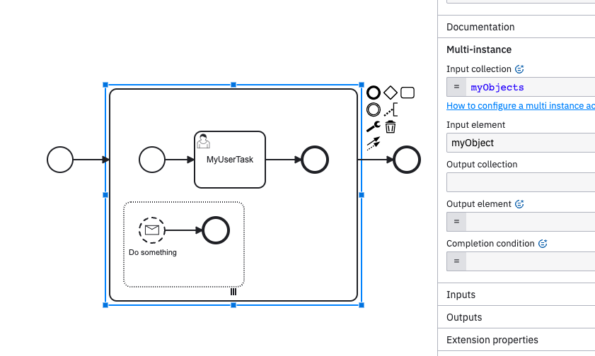
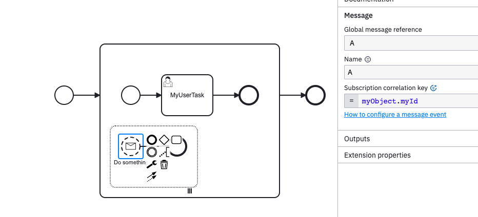
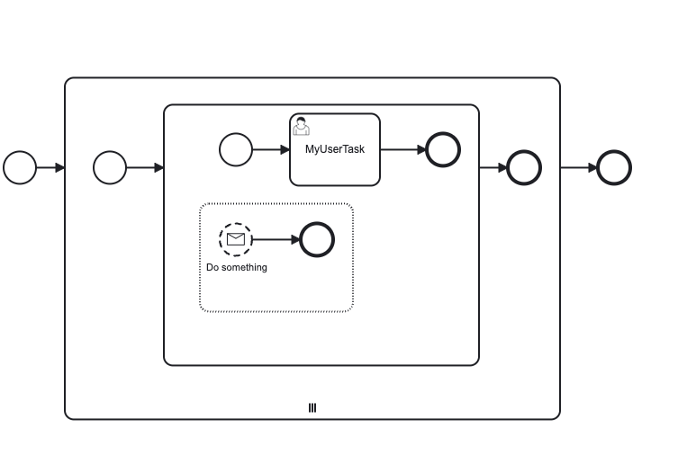

When modelling process like

Incident occurs in Operate "failed to evaluate expression 'myObject.myId': no variable found for name 'myObject'"

Workaround: put another subprocess in multi-instance to make sure input collection gets processed before event-subprocess (probably :-))

failing test and working test (using workaround) provided
